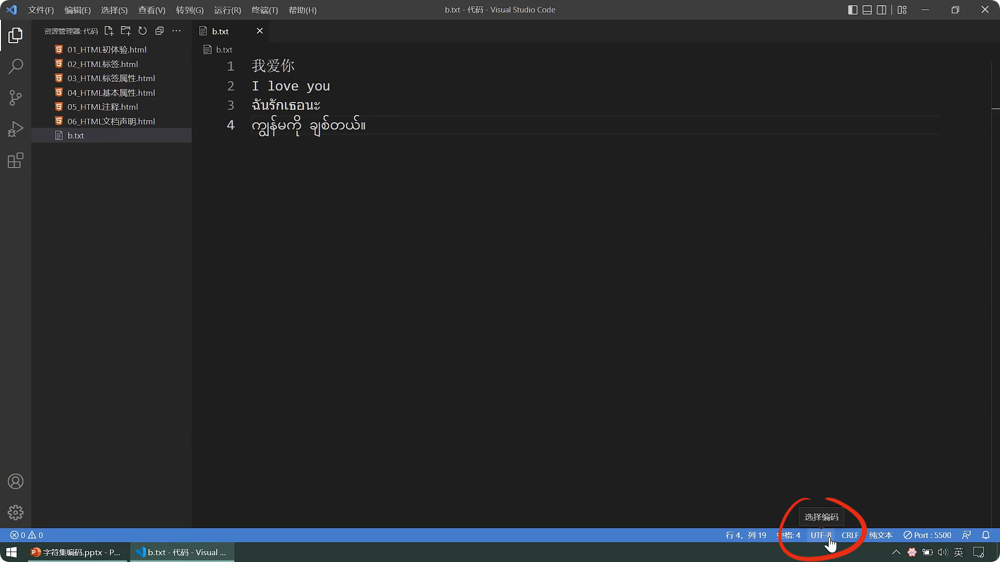

# HTML基础


## 注释

注释顾名思义：备注+解释

那在html代码中，使用 `<!-- -->`进行注释

```html{8,11}
<html>
    <head>
       <title>HTML注释</title>
    </head>
    <body>
        <marquee loop="1">
        尚硅谷
        <!--下面的输入框是可以滚动的，且只能滚动一次-->
        <input type="text">
        </marquee>
        <!--下面的输入框是不可以滚动的-->
        <input type="text">
    </body>
</html>
```


我们查看网页源代码，这个注释也能看到


下方的多一条注释，是Live Server生成的js热更新代码，不用管


代码太多的时候，我们点击行前面的小箭头，还可以折叠代码


注释你可以写多行，但是不能嵌套

错误示范：如果像下面这样嵌套，会导致什么情况出现呢

```html{8-12}
<html>
    <head>
       <title>HTML注释</title>
    </head>
    <body>
        <marquee loop="1">
        尚硅谷
        <!--
            下面的输入框是可以滚动的，
            且只能滚动一次
            <!-- 你可以通过loop属性，操作循环次数-->
        -->
        <input type="text">
        </marquee>
        <!--下面的输入框是不可以滚动的-->
        <input type="text">
    </body>
</html>
```


因为浏览器识别注释的开始标签后，就开始处理，它找到第一个 `-->` 就结束了

::: tip 说明
从第一个 `<!--` 开始与第一个 `-->` 成为一组，第二个 `<!--` 它直接无视了

最后一个 `-->` 被当成了文字
:::


 规范的书写格式是： `<!--+空格+代码或文字+空格+-->`

 ::: tip 说明
 也可以用VSCode的快捷键 `CTRL+/`
:::

```html{12}
<html>
    <head>
       <title>HTML注释</title>
    </head>
    <body>
        <marquee loop="1">
        尚硅谷
        <!--下面的输入框是可以滚动的，且只能滚动一次-->
        <input type="text">
        </marquee>
        <!--下面的输入框是不可以滚动的-->
        <!-- <input type="text"> -->
    </body>
</html>
```


## 文档声明

HTML发展以来有很多的版本，那么我们需要加一个声明，告诉浏览器使用的版本

::: tip 说明
DOC=document，文档

TYPE，类型
:::

```html
<!DOCTYPE html>
```


HTML5是最新版且声明简单，[其他版本声明](https://www.w3.org/QA/2002/04/valid-dtd-list.html) 复杂也不需要深入了解

::: tip 说明
对大小写没有要求，但是建议按规范的写
:::


```html{1}
<!DOCTYPE html>
<html>
    <head>
       <title>HTML注释</title>
    </head>
    <body>
        <marquee loop="1">
        尚硅谷
        <!--下面的输入框是可以滚动的，且只能滚动一次-->
        <input type="text">
        </marquee>
        <!--下面的输入框是不可以滚动的-->
        <!-- <input type="text"> -->
    </body>
</html>
```


::: warning 说明
虽然浏览器默认使用最新的HTML5，但是每个人使用的浏览器不同，所以在代码中我们最好直接声明
:::


拿京东和淘宝举例，我们查看网页源代码也会看到声明


## 字符编码

计算机对数据存储时，对数据进行 `编码` ；读取时对数据进行 `解码`

::: tip 说明
计算机是二进制的运算和存储的
:::

我们在影视剧中常见特工在接头的时候都会采用暗号

而这种暗号就相当于一种 `编码`，读取暗号就相当于 `解码`


编码、解码会遵循一定的规范，它叫做字符集

::: warning 常见字符集
ASCII：美国人制定，大写/小写字母、数字等，共计128个

ISO 8859-1：欧洲人制定，在ASCII基础上扩充了一些希腊字符等，共计是256个

GB2312：中国人制定，扩充收录了 6763 个常用汉字、682个字符

GBK：微软推出，扩充收录的汉字和符号达到 20000+ ，支持繁体中文

UTF-8：[Ken Thompson](https://baike.baidu.com/item/%E8%82%AF%E5%B0%BC%E6%96%AF%C2%B7%E8%93%9D%C2%B7%E6%B1%A4%E6%99%AE%E6%A3%AE)、[Rob Pike](https://baike.baidu.com/item/%E7%BD%97%E5%B8%83%C2%B7%E6%B4%BE%E5%85%8B)推出，包含世界上所有语言的，所有文字与符号，是主流且默认网页编码
:::


由于每个国家字符集编码不同，为了保证全世界通用性，诞生了Unicode编码，就包含万国码 `UTF-8`


::: warning 其他编码小知识
ANSI编码：实际上它是对一些遗留编码的统称，会根据你电脑的语言系统，自动匹配对应的编码，设置语言是中文，ANSI就表示GBK

UTF-16：Unicode的编码方式之一，但无法兼容ASCII

UTF-32：Unicode的编码方式之一，但无法兼容ASCII
:::


代码存储时，务必采用合适的字符编码，否则无法存储，数据会丢失！


存储和读取采用同种方式解码，否则数据错乱（乱码）！


编码的保存可以在VSCode右下角更改的编码方式



通过编码重新打开


选择我们需要的编码即可


那我在代码中如何指定呢，使用 `<meta>` 标签，添加字符集即可

::: tip 说明
不说建议，请直接使用UTF-8编码
:::

```html{4}
<!DOCTYPE html>
<html>
    <head>
        <meta charset="UTF-8">
        <title>HTML注释</title>
    </head>
    <body>
        <marquee loop="1">
        尚硅谷
        <!--下面的输入框是可以滚动的，且只能滚动一次-->
        <input type="text">
        </marquee>
        <!--下面的输入框是不可以滚动的-->
        <!-- <input type="text"> -->
    </body>
</html>
```


我们在淘宝查看网页源代码，也能看到指定了UTF-8编码

::: tip 说明
这里大小写都是可以的，建议还是按规范的写
:::


## 设置语言

编写中...


