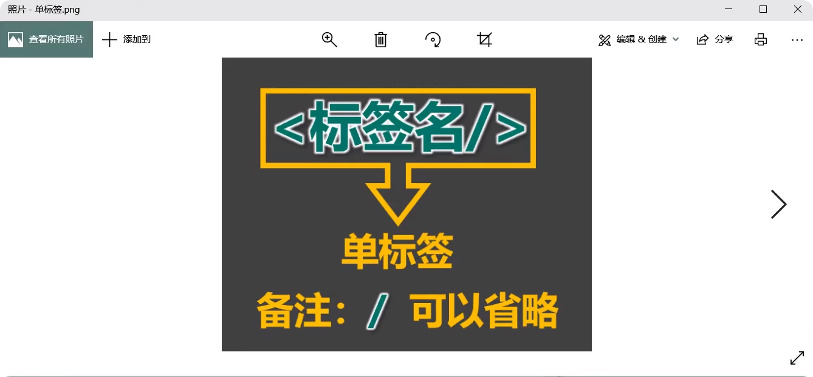
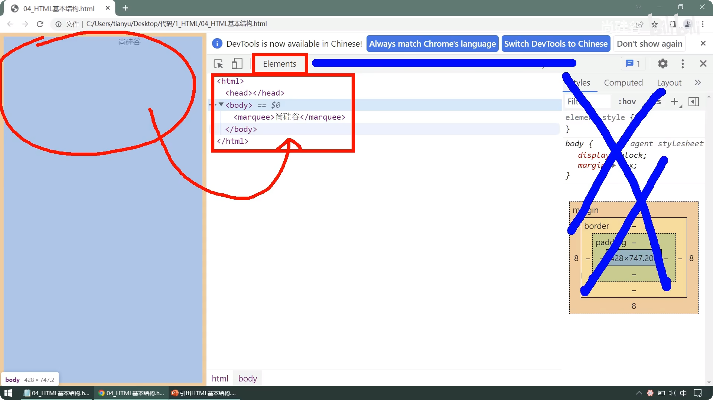
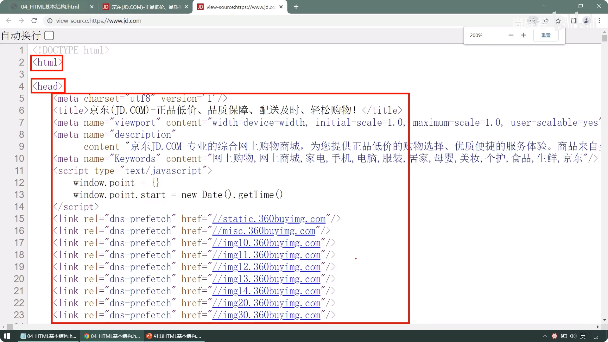

# HTML入门


## 初体验

电脑桌面鼠标右键 - 新建 - 文本文档


命令为 `HTML初体验` ，输入文字，`Ctrl+S键` 保存

```
尚硅谷，让天下没有难学的技术！
```


然后关闭文本，将后缀名`txt`，改成 `html`

系统会提示，点确定即可


再次打开已经改好的文件，它就变成浏览器打开了


鼠标右键html文件 - 用记事本打开，这样就可以边写文本，边预览结果

::: tip 另一种方式
打开记事本，将html文件拖入
:::


我们在文本前后添加一个 `<marquee>` 滚动文字标签，会发现文字在由左往右滚动

::: tip 说明
标签有起始，有结束，缺一不可！

`<marquee>` 是开始标签，`</marquee>` 是结束标签
:::

```html
<marquee>尚硅谷，让天下没有难学的技术！</marquee>
```


实际上是浏览器将我们写的源代码进行渲染，得到了现在的页面


在网页空白处：鼠标右键 -> 查看网页源代码

::: tip 冷知识
按住 Ctrl 键 + 滚轮键 可以放大查看代码
:::


## 标签

标签又称元素，前后都有标签的，我们叫双标签

标签被 `<>` 包裹，且结束标签必须要有 `/`

::: warning 说明
标签的英文虽然大小写皆可，但是规范写法是小写
:::

```html
<起始标签名>标签体</结束标签名>
```


但是有几个显眼包是没有结束标签的，叫单标签

比如 `input`，它是一个输入框

::: warning 说明
单标签 `/` 可以省略，个人建议是都写
:::


```html
<input/>
```




标签之间还可以嵌套，比如我们将 `input` 写入 `marquee`，保存文本刷新网页

```html
<marquee>尚硅谷，让天下没有难学的技术！<input/></marquee>
<input/>
```


嵌套的标签，规范写法是要换行，而且每层都是缩进4个空格，保存刷新

```html
<marquee>
    尚硅谷，让天下没有难学的技术
    <input/>
</marquee>
<input/>
```

::: tip 说明
文字与input是并列关系，保持同样位置即可

后期不用记事本了，我们可以用键盘上的TAB键一键完成缩行
:::


## 标签属性

我们可以在起始标签中添加属性，让标签更丰富


在marquee后面加一个空格，然后输入属性 `loop="1"`，保存刷新

::: tip 说明
loop是循环的意思，1表示循环1次就结束

0、负数和其他字符皆不可用
:::

```html{1}
<marquee loop="1">
    尚硅谷，让天下没有难学的技术
    <input/>
</marquee>
<input/>
```


::: warning 注意
属性值，无论是使用双引号 `"` ，还是单引号 `'` ，都可以

不填虽然也可以，但是按照规范一定要填写
:::

我们再添加一个背景色标签 `bgcolor`，保存刷新

```html{1}
<marquee loop="1" bgcolor="green">
    尚硅谷，让天下没有难学的技术
    <input/>
</marquee>
<input/>
```
::: tip 说明
还可以写成 `bgcolor="#008000"`

RGB转换成16进制：[https://www.kw360.net/color/rgb.html](https://www.kw360.net/color/rgb.html)
:::


而在 `input` 标签中就不适用上面的属性了，它有独有的属性，比如： `type="password"`


```html{3}
<marquee loop="1" bgcolor="green">
    尚硅谷，让天下没有难学的技术
    <input type="password" />
</marquee>
<input/>
```

我们就可以输入，密文密码了


而与之对应的就是明文密码，我们用 `type="text"`

```html{3}
<marquee loop="1" bgcolor="green">
    尚硅谷，让天下没有难学的技术
    <input type="text" />
</marquee>
<input/>
```


::: warning 注意
同一个标签中，不能出现同样的属性，否则默认以第一个为准
:::


属性中也有显眼包，它没有值，比如：disable，禁用

```html{5}
<marquee loop="1" bgcolor="green">
    尚硅谷，让天下没有难学的技术
    <input type="text" />
</marquee>
<input disable />
```
这样输入框就无法输入文本了


## 基本结构

一个完整的HTML网页必须具 `<html>` 、 `<head>` 和 `<body>`

::: tip 说明
head 头部，用来编写网页标题等信息

body 身体，用于编写网页展示的内容
:::

我们写好的源代码，浏览器会进行检查

如果符合HTML格式，则直接渲染；如果不符合，就会自行处理后再渲染


实际上我们之前写的代码都是不完整的

在网页鼠标右键 - 检查(或者审查元素、或者F12开发者工具)

::: tip 区别
查看网页源代码：是查看程序写的源代码

检查：是查看浏览器处理后的代码【常用】
:::


我们只写了 `<marquee>` 这一段，而浏览器给我们补全了

```html
<html>
    <head></head>
    <body>
        <marquee>尚硅谷，让天下没有难学的技术</marquee>
    </body>
</html>
```

::: tip 说明
开发区可以左右拉大，文字可以用滚轮放大
:::


目前我们只需要看 `Elements` 的内容即可，其他现在都用不上




首次打开会提示中文语言选择，请选择 `Don't show again`

::: tip 说明
虽然中文便于我们认识，但是程序的开发就是英文，就当是学习英文吧

已经改成中文的点击小齿轮，将语言改成English，返回点重新加载即可
:::


如果不喜欢开发区在右侧，我们点 `…` ，在dock side 切换自己喜欢的即可

::: tip 说明
从左至右分别是：单窗口、靠左、靠下、靠右
:::


`<head>`标签里的内容需要我们自己写，浏览器的补全并不完整

我们拿 [京东](https://www.jd.com/) 做例子，一样的结构，但是head有内容


我们查看源代码，就显而易见了，所以我们需要自己写完整




我们自己尝试这写一遍完整的代码

```html
<html>
    <head></head>
    <body>
        <marquee>尚硅谷，让天下没有难学的技术</marquee>
    </body>
</html>
```


在 `<head>` 标签中有特定的属性，而不能将 `<body>` 里的属性写入，否则浏览器检查你不合法，就会给你修改


那 `<head>` 里写什么呢，我们可以写网页的标题，或者说页签名

```html
<html>
    <head>
        <title>我的网页</title>
    </head>
    <body>
        <marquee>尚硅谷，让天下没有难学的技术</marquee>
    </body>
</html>
```


