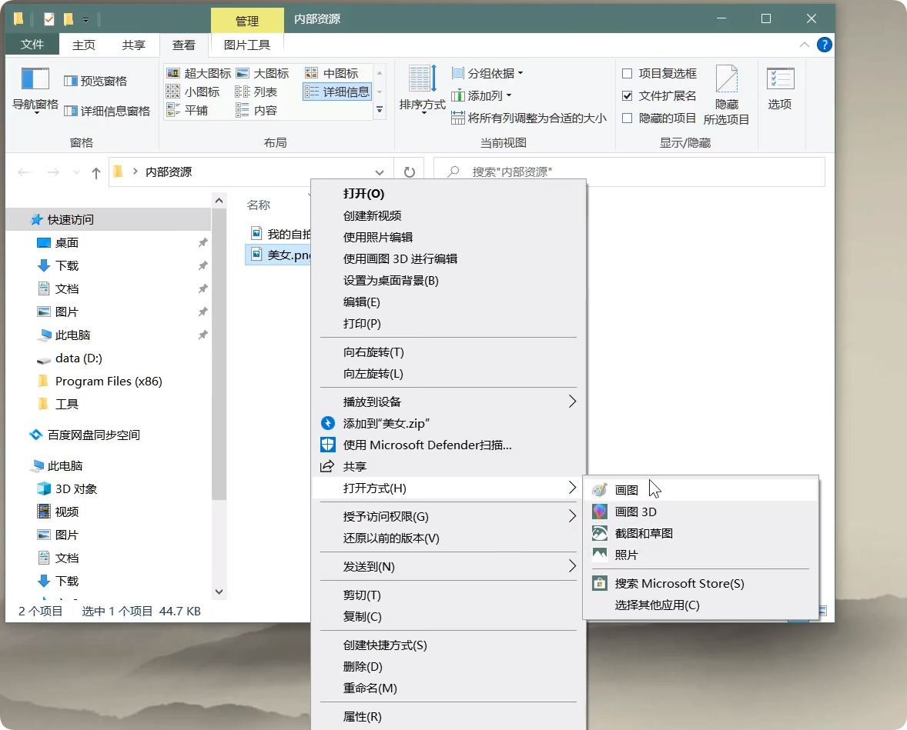

# HTML简介

## 什么是HTML

HTML全称：HyperText Markup Language（<u>超文本标记语言</u>）

::: tip 说明
超文本：暂且简单理解为 “超级的文本”，和普通文本比，内容更丰富

标 记：文本要变成超文本，就需要用到各种标记符号

语 言：每一个标记的写法、读音、使用规则，组成了一个标记语言
:::

## 发展史

早期由 [IETF](https://www.ietf.org/) 起草发布，后由 [W3C](https://www.w3.org/) 接手并维护至今

::: tip 题外话
Adobe公司发布的Flash解决了网页在线游戏、观影的难题

于2017年正式停止对Flash的维护，Flash时代终结
:::

::: tip IETF
全称：Internet Engineering Task Force（国际互联网工程任务组），成立于1985年底，是一个权威的互联网技术标准化组织，主要负责互联网相关技术规范的研发和制定，当前绝大多数国际互联网技术标准均出自IETF

官网：[https://www.ietf.org/](https://www.ietf.org/)
:::

::: warning W3C
全称：World Wide Web Consortium（万维网联盟），创建于1994年，是目前Web技术领域，最具影响力的技术标准机构。共计发布了200多项技术标准和实施指南，对互联网技术的发展和应用起到了基础性和根本性的支撑作用

官网：[https://www.w3.org/](https://www.w3.org/)

---

由于2004年W3C执着于发布新规范XHTML，而不是去更新HTML，引起众多浏览器厂商不满，于是他们联合组建了 [WHATWG](https://whatwg.org/) 并开始制定 HTML5

2009年，W3C迷途知返停止制定XHTML规范，与WHATWG联手开发，于2014年发布了HTML5
:::

::: tip WHATWG
全称：Web Hypertext Application Technology Working Group（网页超文本应用技术工作小组）成立于2004年，是一个以推动网络HTML 5 标准为目的而成立的组织。由Opera、Mozilla基金会、苹果，等这些浏览器厂商组成。

官网：[https://whatwg.org/](https://whatwg.org/)
:::

## 文件拓展名

看文件的后缀名，是我们必备的技能

打开文件夹 - 上方查看标签 - 勾选 文件拓展名

::: tip 冷知识
布局选详细信息，还可以在名称标签栏右键，查看更多的标签信息
:::

## 图片查看程序

图片一般默认的是微软自带的软件，如果不喜欢，可以鼠标右键-打开方式中选择更换

## 浏览器的选择

禹神的推荐是使用 Chrome

::: tip 说明
完全小白建议按禹神的来，这样可以同步操作

如果有点基础且有喜欢的浏览器，可以用自己的上手的
:::

官网：[https://www.google.com/chrome/](https://www.google.com/chrome/)

国内官网：[https://www.google.cn/chrome/](https://www.google.cn/chrome/)

下载安装好后，点击 win键 - 设置，搜默认应用

将默认Web浏览器改成 Chrome 即可

