# 前言

## 讲师：张天禹

无论小白还是有了一定基础，都可以学到东西

B站教程：[https://www.bilibili.com/video/BV1p84y1P7Z5](https://www.bilibili.com/video/BV1p84y1P7Z5)

## 什么是前端开发

前端能开发各种网页，比如：`淘宝` 、`京东`

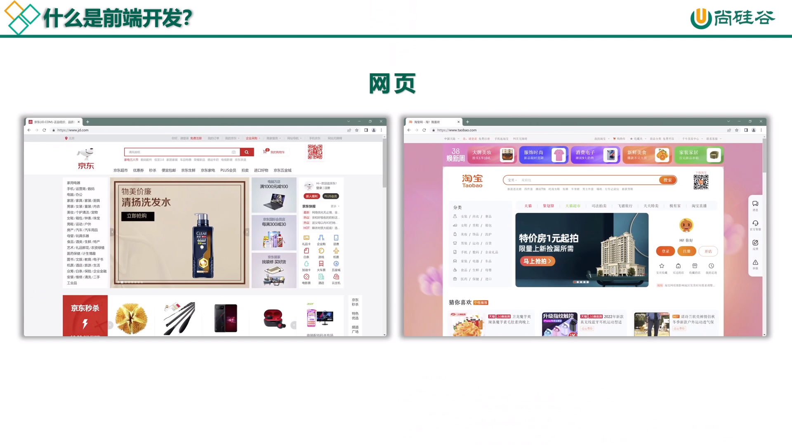

再有就是小程序，比如：`KFC` 、`美团` 、`羊了个羊`

::: tip 说明
小程序还包括：支付宝小程序、抖音小程序等
:::

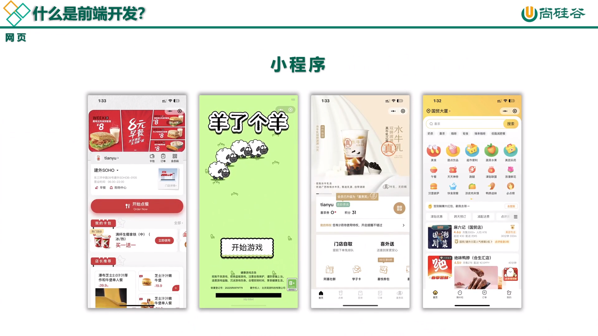

旅游等数据可视化平台

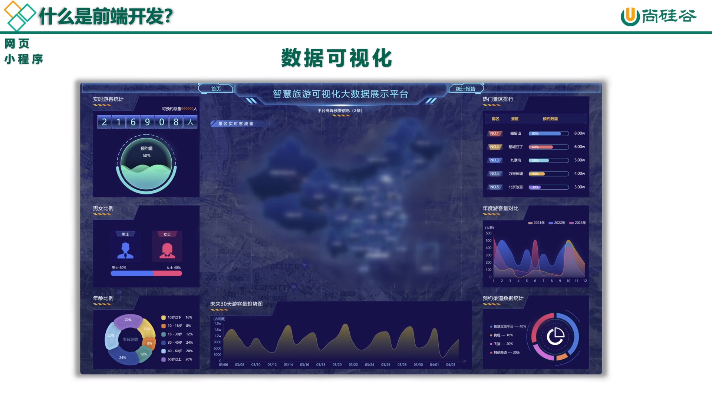

如今已经是大前端时代了，全端工程师也可以开发服务器和客户端

::: tip 狭义的简述
前端：开发我们能看见的页面，供用户使用

后端：开发后台数据管理页面，供管理者使用

大前端：都可以开发，主流框架Vue、React、和Angular
:::

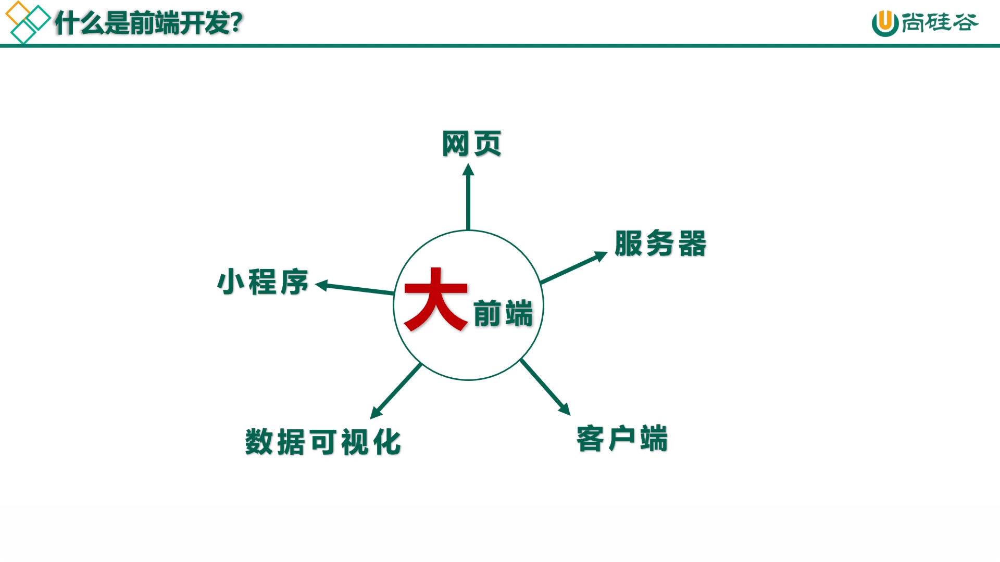

## 学习内容

Web前端的开发，简单讲就是写网页，写网页就必须学好 `HTML+CSS+JS`

::: tip 说明
JavaScript的简称就是 `JS`，这个难一点放在后面学
:::

本期课程的主要内容为 `HTML` 和 `CSS`

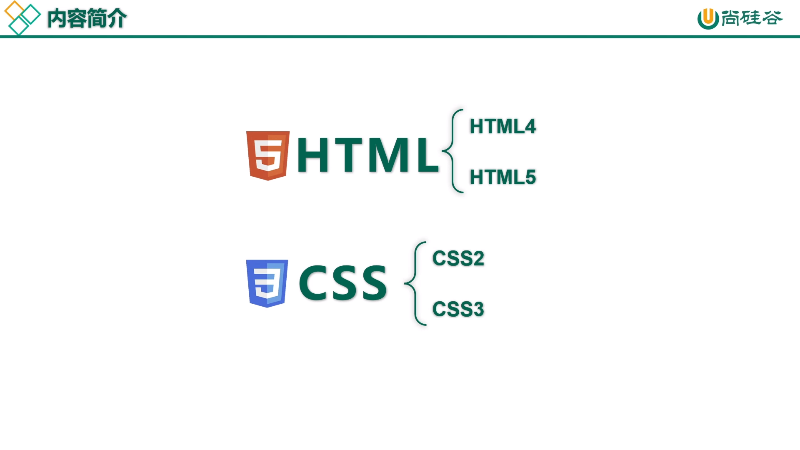

我们将按 `HTML4` -> `CSS2` -> `HTML5` -> `CSS3` 的路线学习

::: tip 说明
看不懂没关系，后面都会详细的讲解
:::

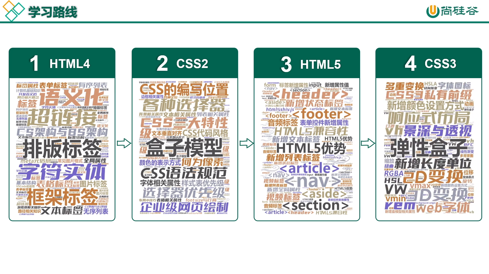

## 认识先驱

[艾伦·麦席森·图灵](https://baike.baidu.com/item/%E8%89%BE%E4%BC%A6%C2%B7%E9%BA%A6%E5%B8%AD%E6%A3%AE%C2%B7%E5%9B%BE%E7%81%B5/3940576)：发明了图灵机，可以进行工程量大的运算

[约翰·冯·诺依曼](https://baike.baidu.com/item/%E7%BA%A6%E7%BF%B0%C2%B7%E5%86%AF%C2%B7%E8%AF%BA%E4%BE%9D%E6%9B%BC/986797)：在图灵基础上，发明了世界第1台计算机及制定了标准

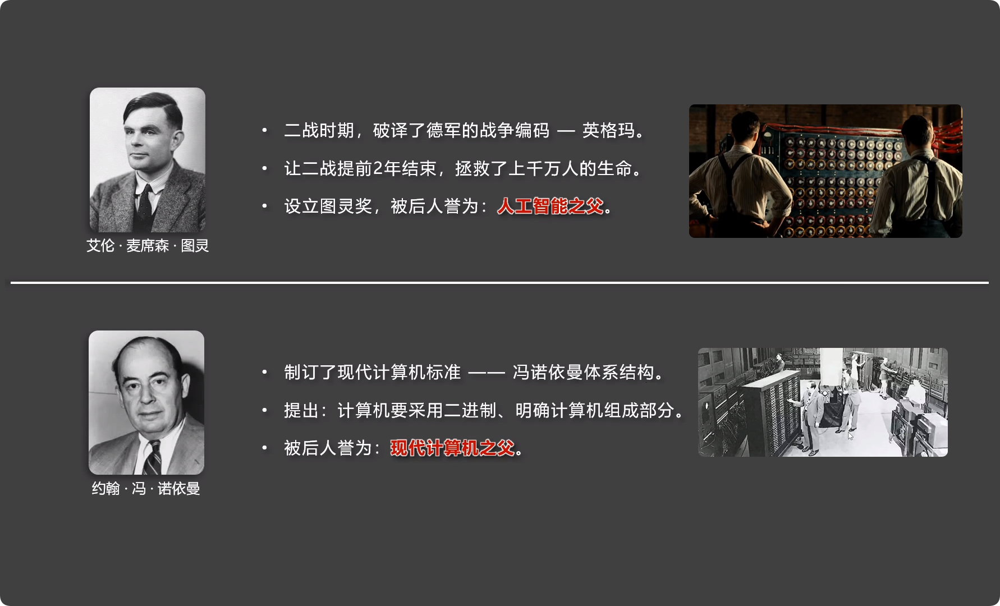

## 计算机基础

计算机俗称电脑，是现代一种用于高速计算的电子计算机器，可以进行数值计算、逻辑计算，还具有存储记忆功能

主要分为 `硬件` 和 `软件` 组成

硬件：CPU、内存、硬盘、键盘、鼠标、音响、显示器 ...

软件 —— 系统软件：Windows、Linux、Mac、Harmony ...

—————应用软件：哔哩哔哩、微信、美图秀秀、腾讯视频 ...

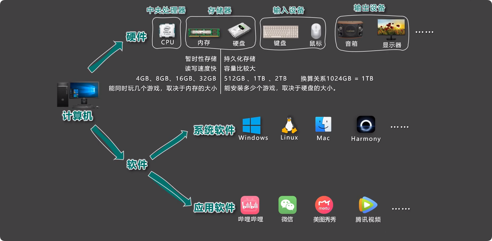

## CS架构与BS架构

我们常见的应用软件分为 `C/S架构` 和 `B/S架构`

C/S架构：Client Server，客户端需要安装，不跨平台

B/S架构：Browser Server，浏览器端不需要安装，可跨平台

::: tip 说明
C/S架构虽然便捷且无需安装，但在专用制图软件、游戏以及隐私度强的航天军工领域，B/S架构不可替代

没有哪种架构更胜一筹，只有更适合的应用场景
:::

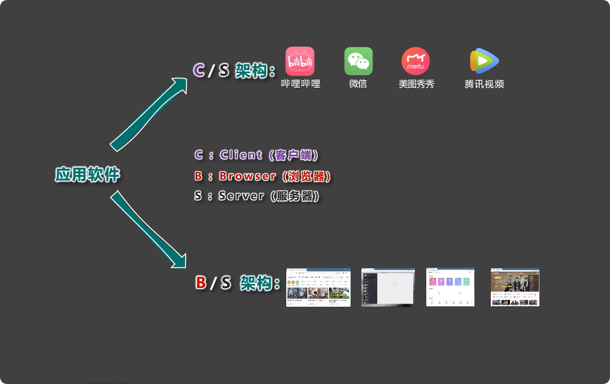

而服务器就是一个中转站，帮我们收发消息以及文件

::: tip 例子
张三在B站上传了视频，视频存储在B站的服务器中，马大爷通过B站客户端或网页看到此视频

然后发出评论，评论上传到B站服务器中，再转发给上传者张三
:::

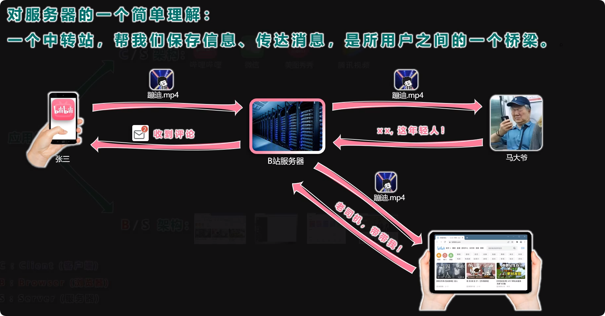

大前端的前景非常好，不仅可以写网页，还能开发小程序、APP以及服务器等等

::: tip 说明
过去的前端工程师主要编写B/S架构中的网页，如今的大前端时代，也可以做C/S架构的工作
:::

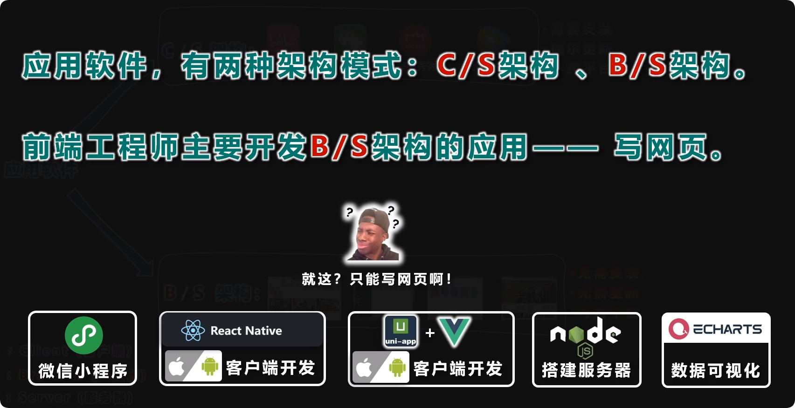

## 浏览器相关知识

浏览器是网页运行的平台，五大主流浏览器： 谷歌(Chrome)、Safari、IE、火狐(Firefox)、欧朋(Opera)

::: tip 说明
为什么Edge、UC、QQ、360、夸克等不在内呢，因为他们只是在这些浏览器内核的基础上，加了一些精美的UI和功能
:::

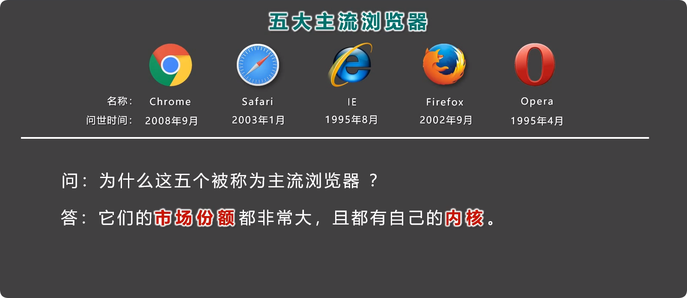

根据2011-2021年的数据显示，Chrome市场份额遥遥领先

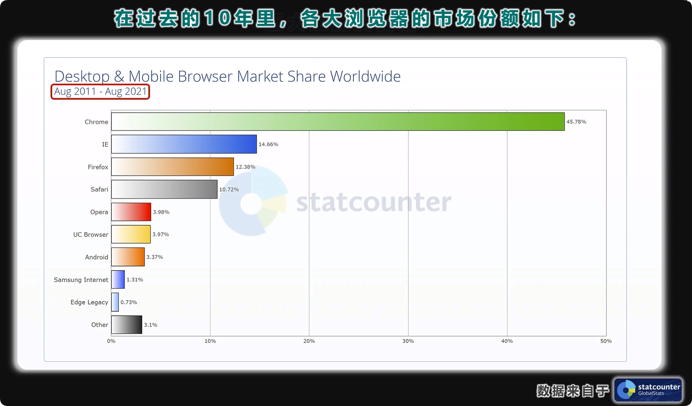

浏览器内核将服务器的文件处理后，得到了我们常见的网页

::: tip 内核
内核是浏览器的核心，用于处理浏览器得到的各种资源
:::

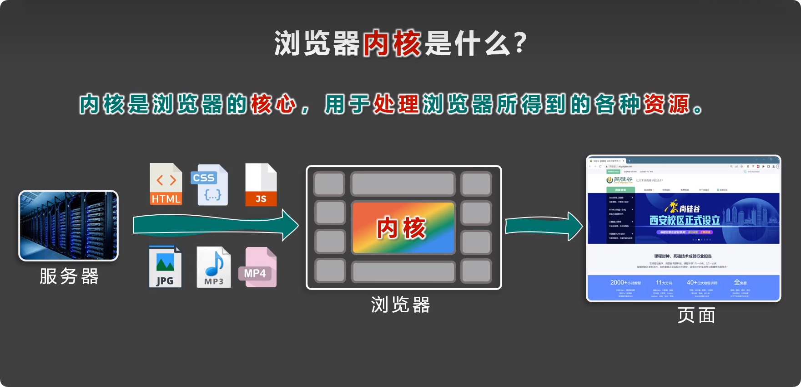

常见的内核有4种，俗称：五大浏览器，四大内核

::: warning 内核参照说明
Chrome和Opera：Blink内核

Safari：webkit内核

IE：Trident内核 (2022年6月15日IE彻底被Edge取代)

Firefox：Geckone内核

---

360/QQ/UC：双内核可自行切换，Blink内核、Trident内核

Edge：基于Chromium，即Chrome一致为Blink内核

夸克：基于Chromium，即Chrome一致为Blink内核
:::

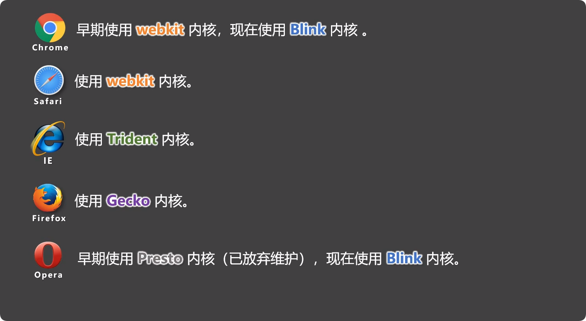

## 网页相关概念

当我们输入一个网址，比如：尚硅谷

官网：[http://www.atguigu.com/](http://www.atguigu.com/)

除了我们进入后的首页，还有其他课堂的页面，而这些所有页面加在一起就构成了网站

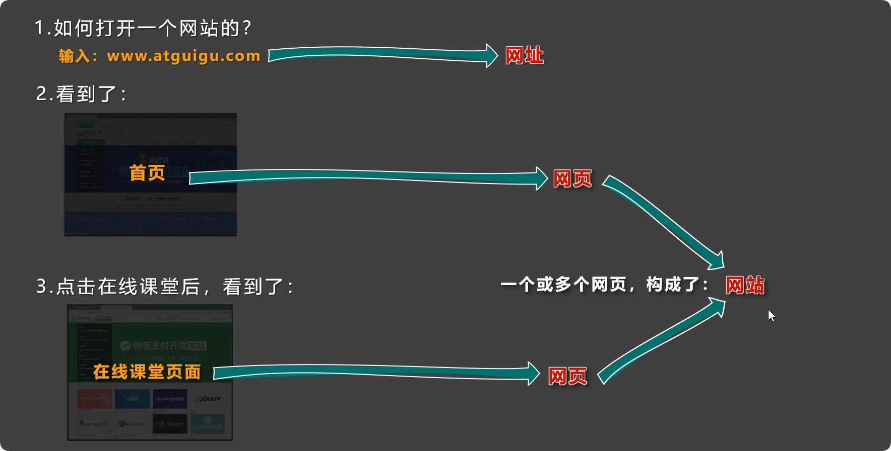

网页的组成分为三个部分：结构、表现、行为

::: tip 拿猴子做例子
结构：就像猴子的骨骼，相当于html

表现：就像猴子的皮肤，相当于css

行为：就像猴子的动作，相当于javascript
:::

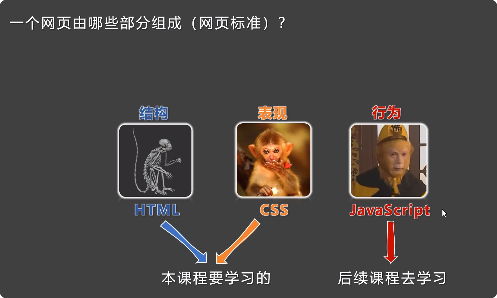